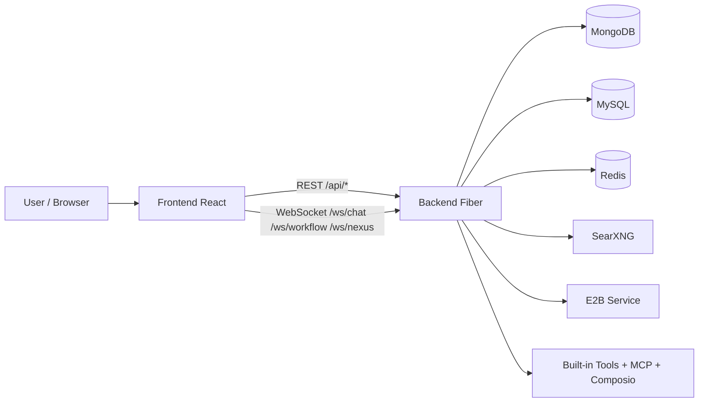
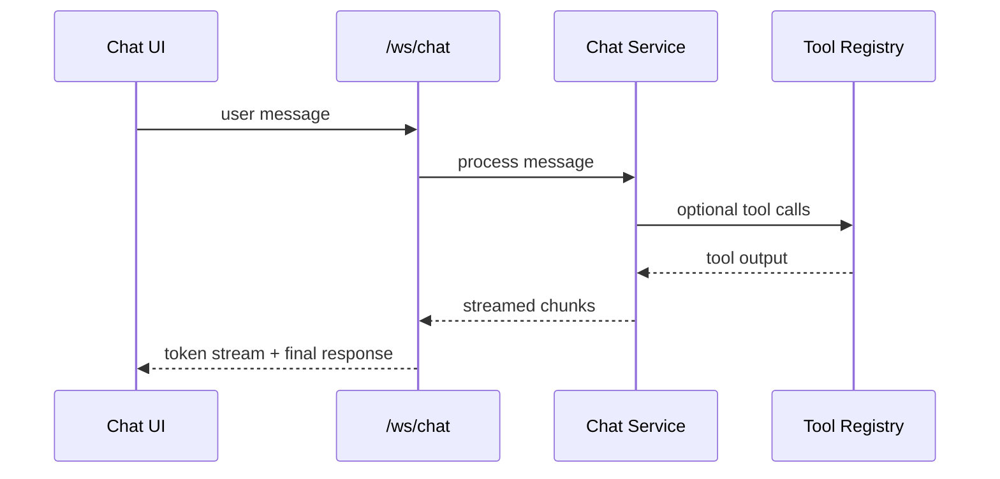
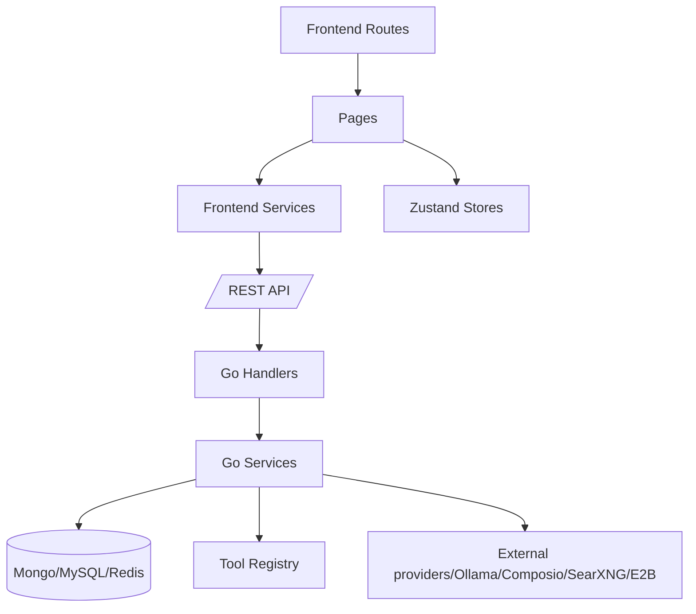

# ClaraVerse Project Review (Research/Technical Overview)

## 1) Tổng quan nhanh

ClaraVerse là một monorepo full-stack cho **private AI workspace** gồm:
- **Frontend**: React 19 + TypeScript + Vite (`/frontend`)
- **Backend**: Go + Fiber + WebSocket (`/backend`)
- **Hạ tầng phụ trợ**: MongoDB, MySQL, Redis, SearXNG, E2B (qua Docker Compose)
- **CLI/Device**: hỗ trợ device auth và companion CLI (`/cli`)

Trục chức năng chính: **Chat AI**, **Agents/Workflows**, **Skills**, **Nexus task board**, **Channels/Routines**, **Credentials/Integrations**, **Admin**.

---

## 2) Cấu trúc project

## Cây thư mục chính

```text
ClaraVerse/
├── backend/                 # Go API + WS + services + tools
│   ├── cmd/server/main.go   # Entry point, wiring services + routes
│   ├── internal/
│   │   ├── handlers/        # HTTP/WS handlers
│   │   ├── services/        # Business logic
│   │   ├── middleware/      # Auth/rate-limit/admin checks
│   │   └── tools/           # Built-in tools registry & implementations
├── frontend/                # React app
│   └── src/
│       ├── pages/           # Route pages (Chat, Agents, Nexus, ...)
│       ├── components/      # UI/layout/feature components
│       ├── services/        # API + client-side services
│       ├── store/           # Zustand stores
│       └── routes/          # Router config
├── docs/                    # Architecture/API/admin/dev docs
├── cli/                     # Installers and CLI helper artifacts
├── searxng/                 # Search engine config
└── docker-compose*.yml      # Local/dev/prod stack orchestration
```

## Sơ đồ kiến trúc code (high-level)



---

## 3) Routing và điểm vào code

### Frontend routes chính (`frontend/src/routes/index.tsx`)
- `/chat`, `/chat/:chatId`, `/artifacts`
- `/agents`, `/agents/builder/:agentId`, `/agents/deployed/:agentId`
- `/skills`, `/skills/new`, `/skills/:skillId/edit`
- `/nexus`, `/nexus/:projectId`
- `/credentials`, `/settings`, `/device`, `/community`, `/notebooks`, `/luma`
- `/admin/*` (dashboard/providers/analytics/models/system-models/code-execution/users)

### Backend entrypoint (`backend/cmd/server/main.go`)
- Khởi tạo middleware (recover, logger, cors, rate-limit)
- Khởi tạo handlers/services
- Gắn nhóm route `/api/*`, `/ws/*`, `/mcp/connect`

---

## 4) Feature review (key points + key functions + cách dùng)

## 4.1 Authentication + User Profile

**Mục tiêu**: đăng ký/đăng nhập JWT local auth, quản lý profile/preference, GDPR export/delete.

**Key-point function (backend):**
- `localAuthHandler.Register/Login/RefreshToken/Logout/GetCurrentUser`
- `userHandler.GetPreferences/UpdatePreferences`
- `userHandler.ExportData/DeleteAccount`

**API chính:**
- `/api/auth/*`
- `/api/user/preferences`
- `/api/user/data`, `/api/user/account`

**Frontend liên quan:**
- `pages/Onboarding.tsx`, `pages/Settings.tsx`
- `store/useAuthStore.ts`, `services/authService.ts`

**Cách sử dụng:**
1. Vào `/signin` để đăng ký/đăng nhập.
2. Sau khi login, vào `/settings` để chỉnh preference.
3. Dùng endpoint GDPR để export/xóa dữ liệu tài khoản khi cần.

---

## 4.2 Chat + Artifacts + Memory

**Mục tiêu**: chat realtime với AI, render artifacts (HTML/SVG/Mermaid), lưu trí nhớ.

**Key-point function (backend):**
- WS chat: `/ws/chat` → `wsHandler.Handle`
- Memory CRUD: `memoryHandler.ListMemories/GetMemory/CreateMemory/UpdateMemory/DeleteMemory`
- Extract memory: `memoryHandler.TriggerMemoryExtraction`

**API/WS chính:**
- `/ws/chat`
- `/api/memories/*`
- `/api/conversations/:id/extract-memories`

**Frontend liên quan:**
- `pages/Chat.tsx`
- `components/artifacts/*` (artifact pane/renderers)
- `store/useChatStore.ts`, `store/useArtifactStore.ts`
- `services/chatService.ts`, `services/memoryService.ts`

**Sơ đồ code (chat stream):**


**Cách sử dụng:**
1. Mở `/chat`.
2. Gửi prompt, theo dõi stream realtime.
3. Nếu message có code fence `html/svg/mermaid`, artifact pane tự mở.
4. Quản lý memory qua API/UI tương ứng.

---

## 4.3 Agents + Visual Workflow Builder

**Mục tiêu**: tạo agent, thiết kế workflow, versioning, schedule, execution history.

**Key-point function (backend):**
- `agentHandler.Create/List/Get/Update/Delete`
- `agentHandler.SaveWorkflow/GetWorkflow/GenerateWorkflow/GenerateWorkflowV2`
- `agentHandler.SelectTools/GenerateWithTools/TestBlock/AutoFillBlock`
- `executionHandler.ListByAgent/GetStats`
- `scheduleHandler.Create/Get/Update/Delete/TriggerNow`

**API chính:**
- `/api/agents/*`
- `/api/executions/*`
- `/api/schedules/usage`

**Frontend liên quan:**
- `pages/Agents.tsx`
- `components/agent-builder/*`
- `store/useAgentBuilderStore.ts`
- `services/agentService.ts`, `workflowService.ts`, `workflowExecutionService.ts`

**Cách sử dụng:**
1. Vào `/agents` tạo agent mới.
2. Mở builder (`/agents/builder/:agentId`) để thiết kế flow.
3. Test block/workflow, lưu version, cấu hình schedule/webhook.
4. Theo dõi execution ở màn hình/history endpoint.

---

## 4.4 Skills System

**Mục tiêu**: quản lý skill cá nhân/community, import/export skill.md, enable/disable theo user.

**Key-point function (backend):**
- `skillHandler.ListSkills/GetSkill/CreateSkill/UpdateSkill/DeleteSkill`
- `skillHandler.GetMySkills/ListCommunitySkills`
- `skillHandler.ImportSkillMD/ImportFromGitHub/ExportSkillMD`
- `skillHandler.EnableSkill/DisableSkill/BulkEnable`

**API chính:**
- `/api/skills/*`

**Frontend liên quan:**
- `pages/Skills.tsx`, `pages/SkillEditor.tsx`
- `store/useSkillStore.ts`
- `services/skillService.ts`

**Cách sử dụng:**
1. Vào `/skills` để xem skill của mình/community.
2. Tạo mới ở `/skills/new` hoặc sửa `/skills/:skillId/edit`.
3. Import từ `.skill.md` hoặc GitHub; bật/tắt skill theo nhu cầu.

---

## 4.5 Nexus (multi-agent task board)

**Mục tiêu**: quản lý project/task dạng board, daemon sessions, persona/engrams/saves.

**Key-point function (backend):**
- `nexusHandler.GetSession/ListTasks/CreateTask/UpdateTask/DeleteTask`
- `nexusHandler.ListProjects/CreateProject/UpdateProject/DeleteProject`
- `nexusHandler.ListDaemons/GetDaemon/CancelDaemon`
- `nexusHandler.GetPersona/GetEngrams`
- WS realtime: `/ws/nexus` → `nexusWSHandler.Handle`

**API/WS chính:**
- `/api/nexus/*`
- `/ws/nexus`

**Frontend liên quan:**
- `pages/Nexus.tsx`
- `components/nexus/*`
- `store/useNexusStore.ts`
- `services/nexusService.ts`

**Cách sử dụng:**
1. Mở `/nexus`.
2. Tạo project/task, kéo thả trạng thái trên board.
3. Theo dõi daemon/task update realtime qua WebSocket.

---

## 4.6 Channels + Routines + MCP server management

**Mục tiêu**: tích hợp kênh (Telegram...), chạy routine định kỳ, quản lý MCP server trong Clara’s Claw.

**Key-point function (backend):**
- Channel: `channelHandler.CreateChannel/ListChannels/TestChannel/TelegramWebhook`
- Routine: `routineHandler.ListRoutines/CreateRoutine/TriggerRoutine/GetRoutineRuns`
- MCP servers: `routineHandler.ListMCPServers/AddMCPServer/UpdateMCPServer/RemoveMCPServer`

**API chính:**
- `/api/channels/*`, `/api/channels/telegram/webhook/:secret`
- `/api/routines/*`
- `/api/mcp/servers/*`
- `/api/claras-claw/status`

**Frontend liên quan:**
- `store/useClawStore.ts`
- `services/channelService.ts`, `services/clawService.ts`, `scheduleService.ts`

**Cách sử dụng:**
1. Tạo channel, verify webhook/secret (Telegram).
2. Tạo routine và trigger test.
3. Theo dõi runs và trạng thái Clara’s Claw.
4. Quản lý MCP server từ UI tương ứng.

---

## 4.7 Credentials + Integrations + Tools registry

**Mục tiêu**: lưu credentials an toàn, bật tích hợp OAuth/Composio, expose tool list theo quyền user.

**Key-point function (backend):**
- Credentials: `credentialHandler.Create/List/Get/Update/Delete/Test`
- Composio: `composioAuthHandler.Initiate*Auth/HandleComposioCallback`
- Tools: `toolsHandler.ListTools/GetAvailableTools/RecommendTools`
- Registry core: `tools/registry.go` (`Register`, `ListDetailed`, `GetCategories`)

**API chính:**
- `/api/integrations`, `/api/integrations/:id`
- `/api/credentials/*`
- `/api/integrations/composio/*`
- `/api/tools/*`

**Frontend liên quan:**
- `pages/Credentials.tsx`
- `store/useCredentialsStore.ts`
- `services/credentialService.ts`, `toolService.ts`, `toolsService.ts`

**Cách sử dụng:**
1. Vào `/credentials` tạo credential cho integration.
2. Với Composio, chạy authorize flow và callback.
3. Trong agent/chat, hệ thống lọc tool available theo credential của user.

---

## 4.8 Admin Console

**Mục tiêu**: quản trị user, analytics, providers/models, system model assignment, E2B settings.

**Key-point function (backend):**
- `adminHandler.GetAdminStatus/ListUsers/GetOverviewAnalytics/...`
- Provider CRUD: `CreateProvider/UpdateProvider/DeleteProvider/ToggleProvider`
- Model mgmt: `modelMgmtHandler.GetAllModels/CreateModel/UpdateModel/DeleteModel/...`
- System models: `systemModelsHandler.GetSystemModelAssignments/UpdateSystemModelAssignments`
- E2B settings: `e2bHandler.GetE2BSettings/UpdateE2BSettings`

**API chính:**
- `/api/admin/*`

**Frontend liên quan:**
- `pages/admin/*` (`Dashboard`, `ProviderManagement`, `Analytics`, `ModelManagement`, `SystemModels`, `E2BSettings`, `UserManagement`)
- Route `/admin/*`

**Cách sử dụng:**
1. Đăng nhập bằng tài khoản admin.
2. Vào `/admin/dashboard` và các tab con để quản trị hệ thống.

---

## 4.9 Device Auth + CLI/Companion

**Mục tiêu**: cho CLI/thiết bị ngoài lấy token theo OAuth Device Flow.

**Key-point function (backend):**
- `deviceAuthHandler.GenerateDeviceCode/PollForToken/RefreshToken`
- `deviceAuthHandler.AuthorizeDevice/ListDevices/RevokeDevice`

**API chính:**
- `/api/device/code`, `/api/device/token`, `/api/devices/*`
- MCP websocket: `/mcp/connect`

**Frontend liên quan:**
- `pages/DeviceAuth.tsx`
- `services/deviceService.ts`

**CLI liên quan:**
- `cli/install.sh`, `cli/claraverse` script

**Cách sử dụng:**
1. CLI yêu cầu device code.
2. User authorize trên web.
3. CLI poll token, sau đó dùng token để gọi API/MCP.

---

## 5) Luồng module tổng quát (code map)



---

## 6) Cách chạy và trải nghiệm nhanh

1. Chạy stack theo README (Docker compose hoặc local dev).
2. Truy cập app, đăng ký user đầu tiên (admin).
3. Đi qua các màn chính:
   - Chat: `/chat`
   - Agents: `/agents`
   - Skills: `/skills`
   - Nexus: `/nexus`
   - Credentials: `/credentials`
   - Device auth: `/device`
   - Admin: `/admin/dashboard`

---

## 7) Ghi chú khảo sát kỹ thuật

- Routing backend tập trung gần như toàn bộ ở `backend/cmd/server/main.go`.
- Hệ thống có phạm vi lớn và phân tách feature tương đối rõ giữa `handlers` và `services`.
- Frontend đã có route/page/store/service cho hầu hết feature quan trọng.
- Tool ecosystem phong phú (nhiều built-in tools, Composio, MCP bridge).
